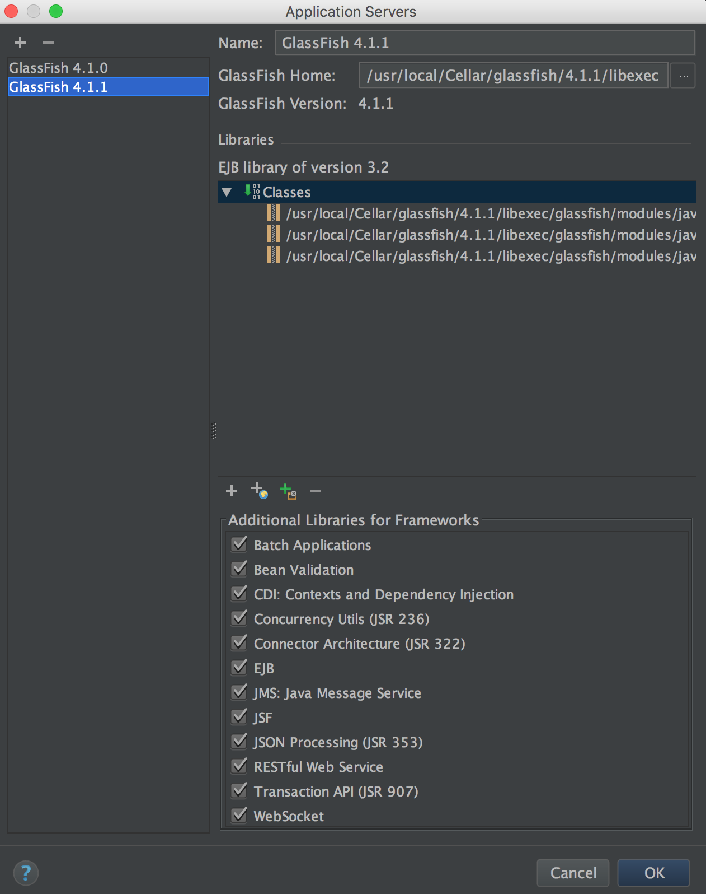

# MCV 1.0 Handson Lab


# Part 1
## Make a Hello World application using MVC 1.0 and Glassfish

(estimated 20mins )

### Requirements:

* Laptop with Java 8 installed
* [Glassfish Nightly downloads](http://download.oracle.com/Glassfish/4.1/nightly/index.html)
    * [zip](http://download.oracle.com/Glassfish/4.1/nightly/Glassfish-4.1-b17-09_16_2015.zip)
    * Mac OSX with [Homebrew](http://brew.sh) `brew install glassfish` in a terminal will install 4.1.1 which is good enough.
* Eclipse or IntelliJ Idea or even NetBeans with configured Glassfish in it.
* Maven


### Step by step

Create new maven project without archetype.
Use `org.gochev` for groupId and  `test-mvc` for artifactId.
Change packaging in the generated pom to `<packaging>war</packaging>`

1) Add this properties:

```xml
<properties>
  <failOnMissingWebXml>false</failOnMissingWebXml>
  <maven.compiler.source>1.8</maven.compiler.source>
  <maven.compiler.target>1.8</maven.compiler.target>
</properties>
```
Add this dependencies :
```xml
<dependencies>
  <dependency>
    <groupId>javax</groupId>
    <artifactId>javaee­api</artifactId>
    <version>7.0</version>
    <scope>provided</scope>
  </dependency>
  <dependency>
    <groupId>javax.mvc</groupId>
    <artifactId>javax.mvc­api</artifactId>
    <version>1.0­edr2</version>
  </dependency>
  <dependency>
    <groupId>org.glassfish.ozark</groupId>
    <artifactId>ozark</artifactId>
    <version>1.0.0­m02</version>
  </dependency>
</dependencies>
```

2) The final POM should look like this :

```xml
<?xml version="1.0" encoding="UTF-8"?>
<project xmlns="http://maven.apache.org/POM/4.0.0"
         xmlns:xsi="http://www.w3.org/2001/XMLSchema-instance"
         xsi:schemaLocation="http://maven.apache.org/POM/4.0.0 http://maven.apache.org/xsd/maven-4.0.0.xsd">
    <modelVersion>4.0.0</modelVersion>
    <groupId>org.gochev</groupId>
    <artifactId>test-mvc</artifactId>
    <version>1.0-SNAPSHOT</version>
    <packaging>war</packaging>
    <properties>
        <failOnMissingWebXml>false</failOnMissingWebXml>
        <maven.compiler.source>1.8</maven.compiler.source>
        <maven.compiler.target>1.8</maven.compiler.target>
    </properties>
    <dependencies>
        <dependency>
            <groupId>javax</groupId>
            <artifactId>javaee-api</artifactId>
            <version>7.0</version>
            <scope>provided</scope>
        </dependency>
        <dependency>
            <groupId>javax.mvc</groupId>
            <artifactId>javax.mvc-api</artifactId>
            <version>1.0-edr2</version>
        </dependency>
        <dependency>
            <groupId>org.Glassfish.ozark</groupId>
            <artifactId>ozark</artifactId>
            <version>1.0.0-m02</version>
        </dependency>
    </dependencies>
    <build>
        <finalName>test-mvc</finalName>
    </build>
</project>
```

3) `mvn clean package` and MAVEN REIMPORT to update the eclipse/idea project libraries
4) Create New class `MyApplication.java`

```java
@ApplicationPath("/app")
public class MyApplication extends Application {}
```

Full source:

```java
package org.gochev;

import javax.ws.rs.ApplicationPath;
import javax.ws.rs.core.Application;

@ApplicationPath("/app")
public class MyApplication extends Application {
}
```

Create a `hello.jsp` in `main/webapp/`

```html
<%@page contentType="text/html" pageEncoding="UTF-8"%> <!DOCTYPE html>
<html>
<head>
    <meta http-equiv="Content-Type" content="text/html; charset=UTF-8">
    <title>Current Time</title></head>
<body>
I am a jsp
</body>
</html>
```
To see that the project is runnable and that the JSP can be shown start glashfish and deploy the test-mvc application, and open [http://localhost:8080/test-mvc/hello.jsp](http://localhost:8080/test-mvc/hello.jsp)

On IDEA : when you add glassfish go RUN glassfish click on the + gassfish local give it some name then choose the domain1 as domain. ON the warning bellow click on fix artifact (the war file)
Also make sure the appropriate OSGI modules have been selected:


On NetBeans : simply RUN the project and select the GlassFish instance as the application server.


Currently we do not have any link between the controller and the jsp just want to see that JSP compiler works and the deployment works.

5) Create a controller `HelloController.java`

```java
@Controller
@Path("hello")
public class HelloController {
    @GET
    public String hello() {
        return "/hello.jsp";
    }
}
```

RUN the project and open [http://localhost:8080/test-mvc/app/hello](http://localhost:8080/test-mvc/app/hello) you should see the JSP again but this time going through the controller.  
Now we will use models and CDI.  
ADD beans.xml because the CDI of MVC 1.0 beans doesn’t work without it (maybe a bug?)

```xml
<?xml version="1.0" encoding="UTF-8"?>
<beans xmlns="http://xmlns.jcp.org/xml/ns/javaee"
       xmlns:xsi="http://www.w3.org/2001/XMLSchema-instance"
       xsi:schemaLocation="http://xmlns.jcp.org/xml/ns/javaee http://xmlns.jcp.org/xml/ns/javaee/"
       bean-discovery-mode="all">
</beans>
```
Do not change the 'bean-discovery-mode' into the recommended 'annotated' as dis will disable correct bean discovery.

The `beans.xml` file should be in `webapp/WEB-INF/beans.xml`

Add `@Inject` Models models and populate it with something as shown bellow:

```java
package org.gochev;

import javax.inject.Inject;
import javax.mvc.Models;
import javax.mvc.annotation.Controller;
import javax.ws.rs.GET;
import javax.ws.rs.Path;

@Controller
@Path("hello")
public class HelloController {
    @Inject
    private Models models;

    @GET
    public String hello() {
        models.put("msg", "Hello World");
        return "/hello.jsp";
    }
}
```

Update the jsp file.

```html
<%@page contentType="text/html" pageEncoding="UTF-8"%>
<!DOCTYPE html>
<html>
  <head>
      <meta http-equiv="Content-Type" content="text/html; charset=UTF-8">
      <title>Current Time</title>
  </head>
  <body>
    I am a jsp and the message for the day is ${msg}
  </body>
</html>
```

Run and open [http://localhost:8080/test-mvc/app/hello](http://localhost:8080/test-mvc/app/hello)  
P.S. Sometimes (randomly) the Glassfish doesn't wont to start even after 1min of waiting... Restart your machine :)

# Part 2 Write a real Submission APP using Java EE with Validation, Users, Entities with JPA relations, DTOs and so on.

## Requirements:
* Import the jugsite project

## Overview of business logic:
* entities package contains the JPA entities
* rest package contains the JAX-RS bootstrap class
* If you want to do anything with sessions, inject and use SessionManager
* If you want to get the current logged in user, create the following field:

```java
@Inject
@LoggedIn
private User currentUser
```

* To change the current user, inject UserContext and call its setter
* UserManager takes care of users
* TestDataInserter inserts some test data from past JUG sessions. The initially logged in user is nayden

## Note:
Make sure you have started the database. If you prefer not to change anything in your persistence.xml, just go to your `<glassfish-dir>/javadb/bin` directory and run the startNetworkServer script for you operating system.

On NetBeans: simply RUN the application on GlassFish. This wil start both database and glashfish instances needed.

# Task 1: Display all the sessions as well as the session by the currently logged in user

## Hints:
* Create a controller that puts into the model the sessions and returns sessions.jsp
* Maybe you need two separate methods in the controller that are listening to two different paths
* Inject the current user as described in the overview of the business logic

## Walkthrough:

1) Add the `SessionController` class in the `bg.jug.website.sessions` package:
`public class SessionController {}`

2) Turn it into a controller by adding the annotations:

* `@Controller` to make it an MVC controller
* `@Path` for the path that it should take care of

```java
@Controller
@Path("/session")
public class SessionController {}
```

3) Implement getting all sessions:

3.1) Assuming this will be a method that listens on GET requests on the /session URI, add one such method and just annotate it with the `@GET` annotation:

```java
@GET
public String showAllSessions() {}
```

3.2) Make the method return session.jsp:

```java
@GET
public String showAllSessions() {
    return "sessions.jsp";
}
```

3.3) Find all the sessions from the SessionManager. Make sure you inject the SessionManager:

```java
@Inject
private SessionManager sessionManager;

@GET
public String showAllSessions(){
    List<JugSession>allSessions=sessionManager.getAllSessions();
    return"sessions.jsp";
}
```

3.4) As the sessions.jsp refers to the allSessions list as submissions, add them to the Models object to that key. Make sure you inject the Models object:

```java
@Inject
private Models models;

@GET
public String showAllSessions() {
    List<JugSession> allSessions = sessionManager.getAllSessions();
    models.put("submissions", allSessions);
    return "sessions.jsp";
}
```

4) Follow the same steps for the logged-in user's sessions:

4.1) This time you will need another GET method in the controller, that listens for requests on a sub-path and returns the sessions.jsp:

```java
@GET
@Path("/currentUser")
public String showAllSessionsForCurrentUser() {
    return "sessions.jsp";
}
```

4.2) Inject the logged­in user and get its submissions:

```java
@Inject
@LoggedIn
private User currentUser;

@GET
@Path("/currentUser")
public String showAllSessionsForCurrentUser() {
    List<JugSession> sessionsForUser = sessionManager.getSessionsForUser(currentUser);
    return "sessions.jsp";
}
```

4.3) Make sure that you add the loaded sessions to the model map:

```java
@GET
@Path("/currentUser")
public String showAllSessionsForCurrentUser() {
    List<JugSession> sessionsForUser = sessionManager.getSessionsForUser(currentUser);
    models.put("submissions", sessionsForUser);
    return "sessions.jsp";
}
```

5) Now if you go to localhost:8080/jugsite/app/session, you will get all the submissions. And if you go to [http://localhost:8080/jugsite/app/session/currentUser](http://localhost:8080/jugsite/app/session/currentUser) – those for the current user

# Task 2: Switch user

## Hints:

* Create a controller that shows the login page upon GET and accepts the parameter from the login form upon POST
* Form parameters are mapped to @PathParam(<parameter-name>) annotated method parameters
* As a result the POST method should redirect either to the home page upon a successful login and back to the login page upon login failure. Check chapter 2.1.4 of the spec on how to make redirects
* Use UserManager to try to login the user. Its get method returns null in case of wrong credentials and the user otherwise
* Make sure you set the found user (if not null) to the UserContext

## Walkthrough:

1) Add a new controller in the bg.jug.website.users package, that listens for request on the /login URI:

```java
@Controller
@Path("/login")
public class LoginController { }
```

2) Make sure that you show login.jsp upon receiving GET request to that URI:

```java
@GET
public String showLoginForm() {
    return "login.jsp";
}
```

3) The form in the JSP sends POST request on this same URI, so add the needed method:

```java
@POST
public String login() { }
```

4) The user name and password come as form parameters, so make sure that the container injects them:

```java
@POST
public String login(@FormParam("userName") String userName,
}
@FormParam("password") String password) {
```

5) Look for the user with such user name and password in the database. Use UserManager to find the user:

```java
@Inject
private UserManager userManager;

@POST
public String login(@FormParam("userName") String userName,
                    @FormParam("password") String password) {
    User foundUser = userManager.getUser(userName, password);
}
```

6) If it is null, redirect to the login form again:

```java
@POST
public String login(@FormParam("userName") String userName,
                    @FormParam("password") String password) {

    User foundUser = userManager.getUser(userName, password);
    if (foundUser == null) {
        return "redirect:/login";
    }
}
```

7) Otherwise, change the current user in the user context and redirect to the home page:

```java
@Inject
private UserContext userContext;

@POST
public String login(@FormParam("userName") String userName,
                    @FormParam("password") String password) {
    User foundUser = userManager.getUser(userName, password);
    if (foundUser == null) {
        return "redirect:/login";
    } else {
        userContext.setCurrentUser(foundUser);
        return "redirect:/";
    }
}
```

# Task 3: Submit a proposal and validate the input

## Hints:

* You should create a controller (or reuse existing) again with a couple of methods: one for showing the form (GET) and another one for handling its submission (POST)
* There is a special @Model bean with bean validation annotations on JugSubmission. Take a look at it
* Chapter 3.2 of the spec describes how to handle validation exceptions
* Consider creating another @Model bean that holds the validation error messages and can be accessed from the JSP via EL as we showed in Part 1

## Walkthrough:

1) First let's implement submitting a new submission:

1.1) Add a new controller for that: bg.jug.website.sessions.SubmissionController:

```java
@Controller
@Path("/submit")
public class SubmissionController { }
```

1.2) Add a method that shows newSession.jsp upon GET request:

```java
@GET
public String showNewSubmissionForm() {
    return "newSession.jsp";
}
```

1.3) Add a method that creates a new session proposal in the database upon POST. Let's use here returning an HTTP response instead of simple string:

```java
@POST
public Response submitSessionProposal() { }
```

1.4) Another method of passing parameters in MVC 1.0 is via so called @BeanParams:

```java
@POST
public Response submitSessionProposal(@BeanParam JugSubmission submission) { }
```

1.5) Create a new JugSession instance from the JugSubmission. At the end, this is what we are going to store in the database:

```java
@LoggedIn
@Inject
private User currentUser;

@POST
public Response submitSessionProposal(@BeanParam JugSubmission submission) {
    JugSession newSession = new JugSession(submission.getTitle(), submission.getDescription(), currentUser);
}
```


1.6) Submit the session and build a response that redirects to the /session URI:

```java
@Inject
private SessionManager sessionManager;

@POST
public Response submitSessionProposal(@BeanParam JugSubmission submission) {
    JugSession newSession = new JugSession(submission.getTitle(), submission.getDescription(), currentUser);
    sessionManager.submitSession(newSession);
    return Response.seeOther(URI.create("session")).build();
}
```

2) Let's now add BeanValidation to the game: 2.1) Make sure that the parameter is validated:

```java
@POST
@ValidateOnExecution(type = ExecutableType.NONE)
public Response submitSessionProposal(@Valid @BeanParam JugSubmission submission) {}
```

2.2) Inject the BinderResult class and use that to check whether the posted object adheres to the bean validation configurations:

```java
@Inject
private BindingResult br;

@POST
@ValidateOnExecution(type = ExecutableType.NONE)
public Response submitSessionProposal(@Valid @BeanParam JugSubmission submission) {
    if (br.isFailed()) {

    }
}
```

2.3) Inside the if, gather all the error messages from the BindingResult and concatenate them in a string:

```java
if (br.isFailed()) {
    String errorMessage = br.getAllViolations().stream()
                            .map(ConstraintViolation::getMessage)
                            .collect(Collectors.joining("<br>"));
}
```

2.4) Create an @Model bean that will hold the error message and at the same time be visible in the JSP file:

```java

@Model
public class MessagesBean {
    private String message;

    public String getMessage() {
        return message;
    }

    public void setMessage(String message) {
        this.message = message;
    }
}
```

2.5) Inject the new MessagesBean, set the error message from 2.3), build a bad request response and put the newSession.jsp as payload there:

```java
@Inject
private MessagesBean messagesBean;

@POST
@ValidateOnExecution(type = ExecutableType.NONE)
public Response submitSessionProposal(@Valid @BeanParam JugSubmission submission) {
    if (br.isFailed()) {
        String errorMessage = br.getAllViolations().stream()
                                .map(ConstraintViolation::getMessage)
                                .collect(Collectors.joining("<br>"));

        messagesBean.setMessage(errorMessage);
        return Response.status(Response.Status.BAD_REQUEST)
                                       .entity("newSession.jsp").build();
    }
    JugSession newSession = new JugSession(submission.getTitle(), submission.getDescription(), currentUser);
    sessionManager.submitSession(newSession);
    return Response.seeOther(URI.create("session")).build();
}
```
